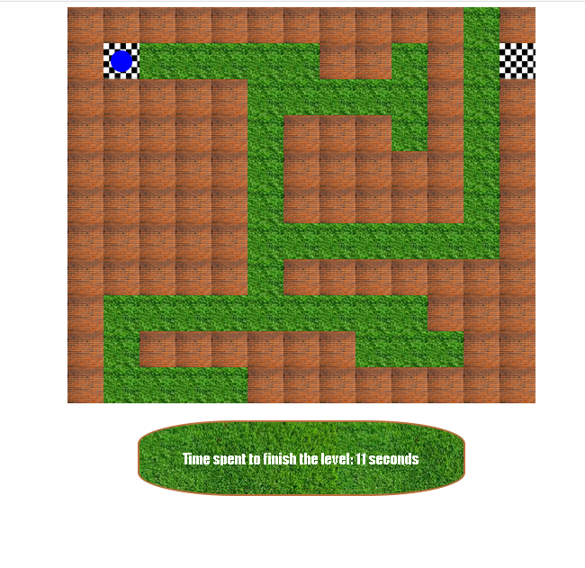

# Maze game :video_game:

- Project made by [Jean Fabry](https://github.com/JeanFabry)
- Trainee at :office: *BeCode* 
- Date : *25/11/2020*

Find the maze [here](https://jeanfabry.github.io/amazeing/)

## What is it?

A maze game with different level.

## What did we do ? 

We created a new [repository](https://github.com/JeanFabry/amazeing), with an HTML file (***index.html***), a JS file (***maze.js***), and a CSS stylesheet (***maze.css***).

## What's the purpose of this?

Our goal was to generate a maze and after add some listener on different key from our keyboard.:left_right_arrow: :arrow_up_down:

## Language use 

- Html5
- CSS3
- JavaScript
* [Instructions](https://github.com/becodeorg/bxl-hopper-1-25/tree/master/The%20Hill/projects/2.amazeing)

## Framework 

- no framework

## Preview

